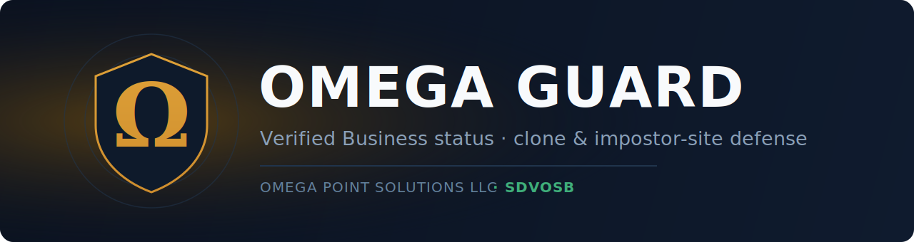

  

  
  
  

# Omega Guard™

**Consumer protection and brand integrity — verify the real business, shut down the fakes.**

Omega Guard helps legitimate businesses prove they're real to their customers, and continuously
finds and helps remove the fraudulent **clone and impostor websites** that impersonate them.

A product of **[Omega Point Solutions LLC](https://omegapointsolutions.com)** — a
Service-Disabled Veteran-Owned Small Business (SDVOSB).

---

## Why it matters

Impersonation fraud is one of the fastest-growing threats to small and mid-sized businesses.
Scammers stand up look-alike websites, ads, and listings that copy a real company's name, logo,
and look — then use them to take deposits, harvest payments, and damage the real business's
reputation. By the time anyone notices, the customer is out the money and the brand takes the blame.

Omega Guard exists to close that gap.

## What members get

**1. Verified Business status.** We confirm a member's authentic digital footprint — their official
websites, phone numbers, and approved payment channels — and issue a public **trust mark** that any
consumer can check before they pay.

**2. Active impostor monitoring.** We continuously watch the public web for sites, listings, and
accounts cloning a member's brand. When we find one, we alert the member, preserve the evidence,
and support getting it taken down.

## Verify a business

Consumers can check whether a website belongs to a verified business at
**[guard.omegapointsolutions.com](https://guard.omegapointsolutions.com)** — enter a domain and see
whether it's a verified member, unknown, or a reported impostor.

## Who it's for

Medical and dental practices · insurance agencies and carriers · auto dealers · financial and
professional services · retailers · home-services businesses — any brand that customers trust with
their money and their data.

## How we work — and what we don't do

Omega Guard is **brand protection and consumer protection**. It monitors the public web for impostors
of **enrolled, consenting members only**. It is **not** a surveillance, profiling, or biometric
system, and it does not build profiles of people. Our software assists; a trained human reviews and
decides before anything is acted on. AI involvement is always disclosed.

## Learn more / enroll

Visit **[omegapointsolutions.com](https://omegapointsolutions.com)** or get in touch through the site.

---

© 2026 Omega Point Solutions LLC. "Omega Guard" is a trademark of Omega Point Solutions LLC.
This repository contains public marketing information only — all product source is maintained
privately. See [`LICENSE`](LICENSE).
